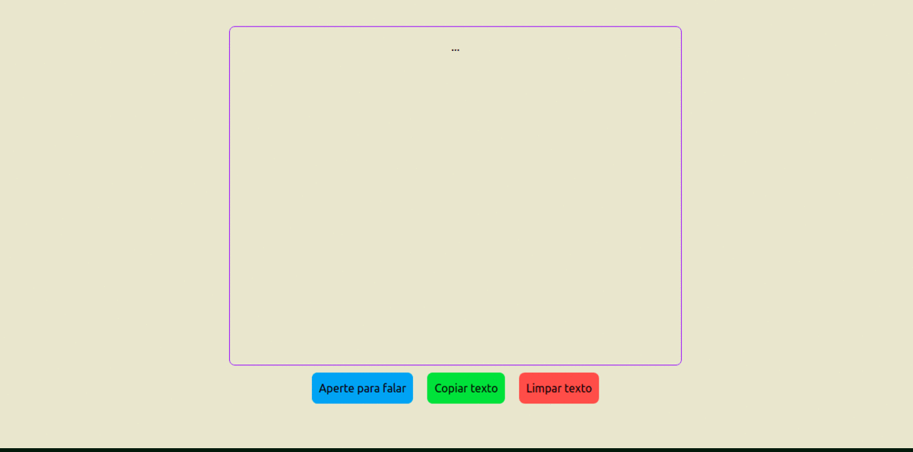

# 🎙 API - Transform voice to text v1.0

<p align="center">
  
  
  
  
  
</p>

Essa aplicação utliza a WEB API do browser Chrome que permite transformar a voz em texto com Speech Recognition. Mostrada no canal
da [Rocketseat](https://www.youtube.com/watch?v=vuHa90tFojc&list=WL&index=6&ab_channel=Rocketseat).

## :computer: Tecnologias

Este projeto foi desenvolvido com as seguintes tecnologias:

-  [SpeechRecognition.onend](https://developer.mozilla.org/en-US/docs/Web/API/SpeechRecognition/onend)
-  [Javascript](https://developer.mozilla.org/pt-BR/docs/Web/JavaScript)
-  [CSS3](https://developer.mozilla.org/pt-BR/docs/Web/CSS)
-  [HMTL](https://developer.mozilla.org/pt-BR/docs/Web/HTML)
-  [Tailwindcss](https://tailwindcss.com/)
-  [VS Code](https://code.visualstudio.com/)

### :arrow_forward: Em Execução:

<p align="center">
 
</p>

### :information_source: Como usar:

Para clonar e executar esta aplicação, você precisará do Git instalado em seu computador. Na linha de comando:

```bash
# Clonar este repositório
$ git clone https://github.com/DiegoTeixeira7/APITransformVoiceToText.git

# Vá para o repositório
$ cd APITransformVoiceToText

# Execute o projeto

```
### :memo: Licença
Este projeto está sob a licença do MIT. Consulte a [LICENSE](LICENSE) para obter mais informações.
